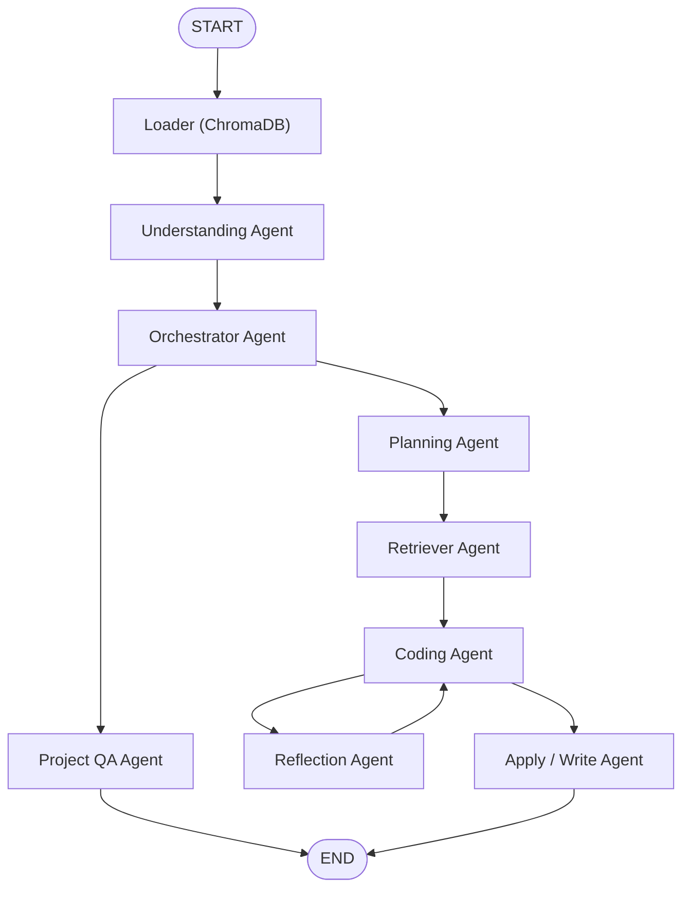

# 🤖 AI Software Engineering Team

> A **multi-agent AI Software Engineering Assistant** built with **LangGraph** that understands existing codebases, answers project-specific questions, plans feature implementations, generates code, and performs iterative code review through a team of specialized AI agents.


---

## Overview

Modern AI coding assistants are excellent at generating code, but they often lack an understanding of the overall project architecture and provide limited control over the software development workflow.

This project implements an **AI Software Engineering Team** where multiple specialized agents collaborate to solve software engineering tasks. Instead of relying on a single LLM, the system routes requests to dedicated agents responsible for understanding the codebase, answering repository questions, planning implementations, retrieving relevant context, generating code, reviewing it, and applying changes.

The workflow is orchestrated using **LangGraph**, enabling structured, stateful interactions between agents.

---

# Features

* 🤖 Multi-agent architecture using LangGraph
* 💬 Conversational chatbot interface
* 📂 Automatic project loading and indexing
* 🧠 AI-generated project understanding
* 🔍 Retrieval-Augmented Generation (RAG) for repository questions
* 📋 AI implementation planning
* ✅ Human-in-the-loop approval workflow
* 🎯 Context-aware code retrieval
* 💻 AI code generation
* 🔄 Reflection-based code review loop
* 📝 Automatic code application
* 🗂️ Persistent vector database using ChromaDB
* ⚡ Local LLM support through Ollama

---

# Architecture


---

# Agent Workflow

| Agent                   | Responsibility                                                                                            |
| ----------------------- | --------------------------------------------------------------------------------------------------------- |
| **Loader**              | Loads the repository, scans files, chunks source code and builds vector embeddings.                       |
| **Understanding Agent** | Generates a high-level understanding of the project architecture, technologies, modules and entry points. |
| **Router / Chatbot**    | Understands user intent and routes requests to the correct agent. Maintains conversational history.       |
| **Project QA**          | Answers project-specific questions using Retrieval-Augmented Generation (RAG).                            |
| **Planner**             | Creates structured implementation plans before any code is generated.                                     |
| **Human Approval**      | Allows the user to approve, revise or cancel the implementation plan.                                     |
| **Retriever**           | Retrieves only the relevant project files needed for the task.                                            |
| **Coder**               | Generates code using the approved plan and retrieved project context.                                     |
| **Reflection**          | Reviews generated code and requests improvements until the solution meets the required quality.           |
| **Apply**               | Writes the approved code back into the project.                                                           |

---

# Technologies

### AI

* LangGraph
* LangChain
* Ollama

### Embeddings

* HuggingFace Embeddings
* BAAI/bge-small-en-v1.5

### Vector Database

* ChromaDB

### Language

* Python 3.13

### Supporting Libraries

* Pydantic
* python-dotenv

---

# Project Structure

```text
.
├── agents/
│   ├── loader.py
│   ├── router.py
│   ├── understanding.py
│   ├── project_qa.py
│   ├── planner.py
│   ├── retriever.py
│   ├── coder.py
│   ├── reflection.py
│   └── apply.py
│
├── prompts/
├── models/
├── schemas/
├── graph.py
├── state.py
├── main.py
└── requirements.txt
```

---

# How It Works

1. The user provides the project path.
2. The Loader indexes the project and creates embeddings.
3. The Understanding Agent analyzes the repository and generates a project summary.
4. The Router receives every user request.
5. Depending on the request:

   * Project questions are routed to the **Project QA Agent**.
   * Feature requests are routed to the **Planner Agent**.
   * General conversation is handled directly by the Router.
6. The Planner creates an implementation plan.
7. The user approves, revises, or cancels the plan.
8. The Retriever fetches only the relevant project context.
9. The Coder generates code.
10. The Reflection Agent reviews the generated code and requests revisions if necessary.
11. Once approved, the Apply Agent writes the changes back to the project.

---

# Example Use Cases

### Understand an Existing Project

```
User:
Explain how authentication works.
```

The Project QA Agent retrieves the relevant files and explains the authentication flow.

---

### Add a New Feature

```
User:
Add JWT Authentication.
```

Workflow:

```
Planner
    ↓
Human Approval
    ↓
Retriever
    ↓
Coder
    ↓
Reflection
    ↓
Apply
```

---

### Explain Repository Structure

```
User:
What is the purpose of the services folder?
```

The system retrieves only the relevant project files before answering.

---

# Running the Project

## 1. Clone the Repository

```bash
git clone https://github.com/<username>/<repository>.git

cd <repository>
```

---

## 2. Create a Virtual Environment

### macOS / Linux

```bash
python3 -m venv venv

source venv/bin/activate
```

### Windows

```bash
python -m venv venv

venv\Scripts\activate
```

---

## 3. Install Dependencies

```bash
pip install -r requirements.txt
```

---

## 4. Install Ollama

Download and install Ollama:

https://ollama.com

Pull the required model:

```bash
ollama pull qwen3:8b
```

Verify that Ollama is running before starting the application.

---

## 5. Configure Environment Variables

Create a `.env` file in the project root.

Example:

```env
MODEL_NAME=qwen3:8b
```

---

## 6. Run the Application

```bash
python main.py
```

The application will prompt for the project path before starting the AI software engineering workflow.

---

# Future Improvements

* VS Code extension
* Git integration
* Automatic test generation
* Streaming responses
* Multi-project support
* Tool calling
* Memory across sessions
* Code diff preview
* Automatic documentation generation

---

# License

This project is licensed under the MIT License.

---

# Author

**Ishaan**

Final Year Computer Engineering Student

Interested in **Agentic AI**, **LLM Systems**, **Software Engineering**, and **Cybersecurity**.
